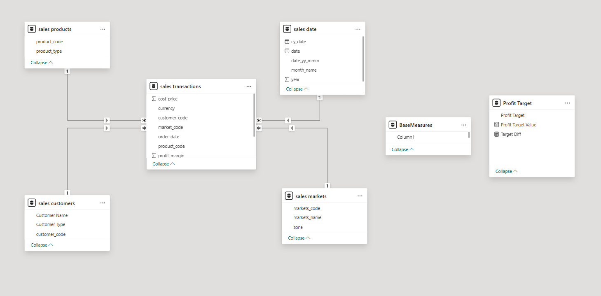
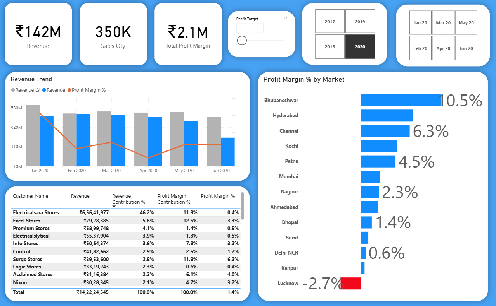
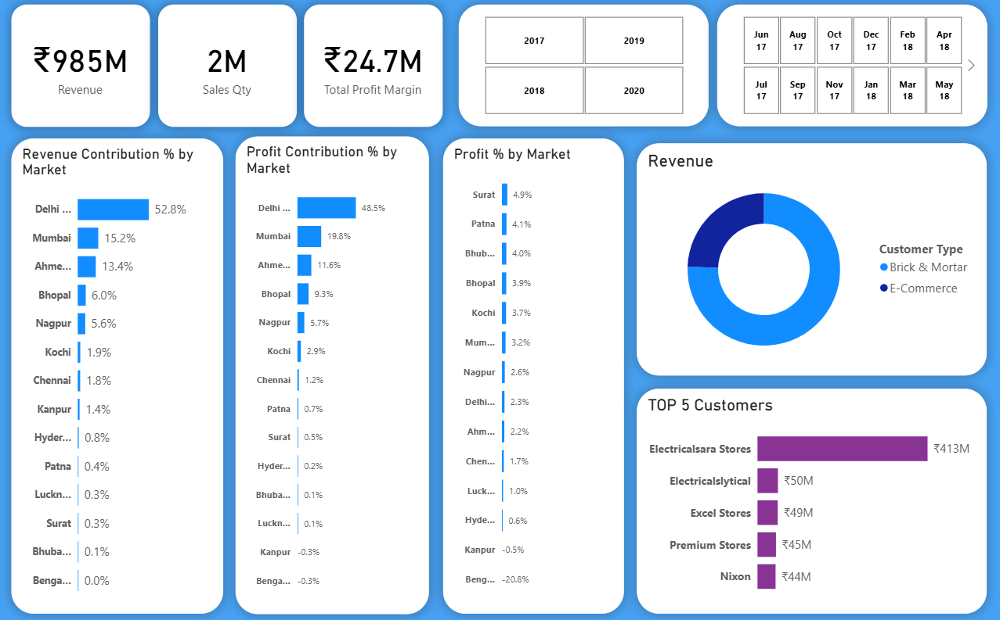

# Sales Insights (Brick and Motor Business) – Power BI Project

## Project Overview
This project demonstrates an end-to-end **Business Intelligence workflow** using **SQL and Power BI** to analyze sales data and generate actionable business insights.

The workflow includes:

SQL Data Exploration → ETL → Data Modeling → DAX Calculations → Interactive Dashboard

This project simulates a **real-world Data Analyst workflow used in industry**.

---

# Project Architecture

SQL Database
    ↓
Data Exploration using SQL
    ↓
Data Import to Power BI
    ↓
ETL with Power Query
    ↓
Data Modeling (Star Schema)
    ↓
DAX Measures
    ↓
Interactive Dashboard

---

# 1. Data Exploration (SQL)

Initial analysis was done in **MySQL Workbench** to understand the dataset.

Key tasks:
- Inspecting tables
- Understanding relationships
- Checking record counts
- Identifying data inconsistencies

Main Tables:

- customers
- products
- markets
- transactions
- date

---

# 2. Database Versions

Two SQL dump files are provided:

| File | Description |
|-----|-------------|
| dump_db.sql | Original dataset used for initial analysis |
| dump_db_updated.sql | Updated dataset with additional columns in the transactions table |

The updated schema allowed better analytical calculations.

---

# 4. Data Transformation (Power Query)

- Data was cleaned and standardized in Power Query by correcting data types, filtering invalid records, and preparing the dataset for analysis.

# 5. Data Modeling

- Relationships were created between the relevant tables to support analysis across customers, products, markets, and transactions.

---

# 6. DAX Measures

DAX (Data Analysis Expressions) was used to create business metrics for the dashboard.

### Total Revenue

```
Revenue = SUM(transactions[sales_amount])
```

### Total Sales Quantity

```
Sales Quantity = SUM(transactions[sales_qty])
```

### Revenue in Millions

```
Revenue (Millions) = DIVIDE([Revenue],1000000)
```

### Profit (Example Measure)

```
Profit = SUM(transactions[sales_amount]) - SUM(transactions[cost_price])
```

### Revenue by Market

```
Revenue by Market = CALCULATE(
    [Revenue],
    ALLEXCEPT(markets, markets[market_name])
)
```

### Yearly Revenue

```
Yearly Revenue = CALCULATE(
    [Revenue],
    YEAR(date[date])
)
```

These measures help generate **dynamic business insights across different dimensions like time, customer, product, and market.**

---

# Power BI Dashboard

The Power BI dashboard provides a **visual summary of sales performance**.

Key insights:

- Revenue trend over time
- Top performing markets
- Top customers
- Product performance
- Sales quantity analysis

---

# Dashboard Shots

## Model View


## Profit Controller


## Revenue Controller


---

# Project Files

| File | Description |
|-----|-------------|
| Sales_Insights_Data_Analysis_Project.pbix | Power BI project file |
| dump_db.sql | Initial database dump |
| dump_db_updated.sql | Updated database dump |

---

# Tools & Technologies

- SQL
- MySQL Workbench
- Power BI
- Power Query
- DAX

---

# Skills Demonstrated

- SQL Data Exploration
- Data Cleaning & ETL
- Data Modeling
- DAX Calculations
- Business Intelligence
- Dashboard Development
- Data Storytelling

---

# How to Run the Project

Step 1  
Import the SQL database using:

dump_db_updated.sql

Step 2  
Open the Power BI project:

Sales_Insights_Data_Analysis_Project.pbix

Step 3  
Update database credentials if required.

Step 4  
Refresh the dataset.

---

# Project Outcome

This project demonstrates how raw transactional data can be transformed into **meaningful business insights using SQL and Power BI**, following a professional analytics workflow.
